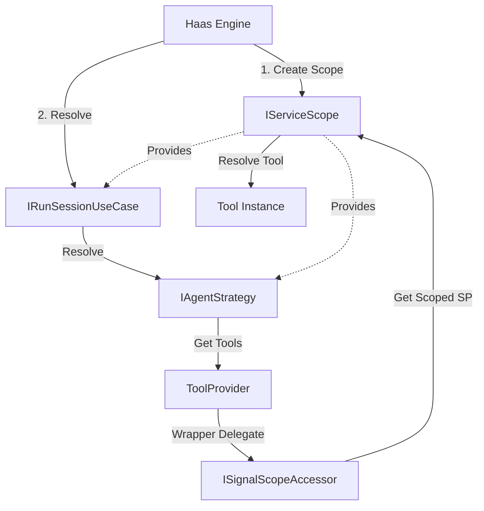

# Requirements

### Overview & Goals
The goal is to enhance the tool registration system to support registering tools by class type through a generic method, allowing for late resolution of tool instances from the IoC container during execution. Additionally, we will introduce proper lifecycle management by ensuring each signal processing run occurs within its own DI scope, similar to how web requests are handled in web frameworks.

### Scope
- **In Scope**:
    - Adding a generic `Register<T>` method to `IToolProvider`.
    - Implementing per-signal DI scope management in both direct and queued engines.
    - Providing a mechanism for tools to access the current scoped service provider.
    - Updating system documentation to reflect these architectural changes.
- **Out of Scope**:
    - Changing existing non-generic tool registrations.
    - Modifying the Microsoft Agent Framework itself.

# Technical Design

### Current Implementation
- `IToolProvider` only supports manual registration of `ToolDefinition` objects containing a `Delegate`.
- `ToolProvider` is a singleton that stores these definitions in a concurrent dictionary.
- Engines process signals without explicit per-signal DI scope management.

### Key Decisions
- **Generic Registration Signature**: Use `Expression<Func<T, Delegate>>` to allow type-safe method selection using method groups with explicit casts.
- **Scope Management**: Introduce `ISignalScopeAccessor` using `AsyncLocal<IServiceProvider>` to allow singleton services like `ToolProvider` to access the current scoped provider.
- **Engine-Level Lifecycles**: The engines (`DirectHaasEngine` and `QueuedHaasEngine`) will be responsible for creating and disposing scopes for each signal processing task.
- **Scoped Use Case**: `IRunSessionUseCase` and its dependencies (like `IAgentStrategy`) will be changed from `Singleton` to `Scoped` to ensure a fresh execution context per signal.

### Proposed Changes
- **HaaS.Domain**:
    - Add generic `Register<T>` to `IToolProvider`.
- **HaaS.Infrastructure**:
    - Add `ISignalScopeAccessor` to manage the "current" scoped `IServiceProvider`.
    - Update `DirectHaasEngine` and `QueuedHaasEngine` to wrap `ProcessSignalAsync` and worker loops in service scopes.
    - Update `ServiceCollectionExtensions.cs` to change `IRunSessionUseCase`, `RunSessionUseCase`, and `IAgentStrategy` to `Scoped`.
- **HaaS.Adapters**:
    - Update `ToolProvider` to implement `Register<T>`. It will use `Expression` trees to build a wrapper delegate that:
        1. Accesses `ISignalScopeAccessor.ServiceProvider`.
        2. Resolves an instance of `T`.
        3. Invokes the selected method.

### Architecture Diagram

# Testing

### Validation Approach
Verification will be performed through unit tests and manual integration tests in the CLI host.

### Key Scenarios
- **Generic Registration**: Register a tool using the new generic method and verify it executes correctly.
- **IoC Resolution**: Verify that a tool registered via generic is resolved from the service provider at runtime.
- **Scoped Lifetime**: Verify that a tool with a scoped dependency receives a fresh instance per signal run.
- **Queued Engine Scoping**: Verify that the queued engine correctly creates a new scope for every dequeued signal.

# Delivery Steps

### ✓ Step 1: Implement generic registration and scope accessor infrastructure
Introduce the new generic `Register` method and the lifecycle management infrastructure.

- Add `void Register<T>(string name, string description, Expression<Func<T, Delegate>> methodSelector) where T : class` to `IToolProvider.cs`.
- Create `ISignalScopeAccessor` and its implementation in `HaaS.Infrastructure` to manage `AsyncLocal` service scopes.
- Register `ISignalScopeAccessor` as a singleton in `ServiceCollectionExtensions.cs`.

### ✓ Step 2: Implement ToolProvider generic registration and IoC resolution
Implement the logic to handle generic registrations and resolve tools from IoC.

- Update `ToolProvider` to implement the new generic `Register` method.
- Use `Expression` trees to create wrapper delegates that resolve the tool instance from the current scope via `ISignalScopeAccessor`.
- Add unit tests in `ToolProviderTests.cs` to verify that tools are correctly resolved and executed within a scope.

### ✓ Step 3: Integrate lifecycle management into engines and update documentation
Update the engines to manage the DI scope for each signal processing run and update service registrations.

- Modify `DirectHaasEngine.ProcessSignalAsync` to create and dispose a service scope for each signal, and resolve `IRunSessionUseCase` from it.
- Modify `QueuedHaasEngine.RunWorkerAsync` to create and dispose a service scope inside its processing loop for every signal, and resolve `SignalWorker` from it.
- Update `ServiceCollectionExtensions.cs` to register `IRunSessionUseCase`, `RunSessionUseCase`, and `IAgentStrategy` as `Scoped` instead of `Singleton`.
- Ensure `ISignalScopeAccessor` is correctly updated when scopes are created and disposed.
- Update `SYSTEM-DESIGN.md` with a new section on Signal Execution Lifecycle.