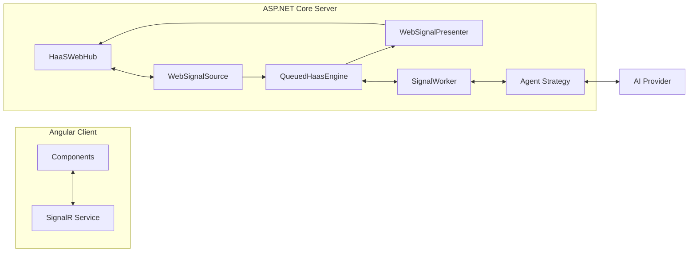

# Requirements

### Overview & Goals
The goal is to introduce a web-based dashboard for HaaS examples, demonstrating how the library can be integrated into a modern web stack (ASP.NET Core + Angular + Tailwind). 

Key objectives:
- Showcase real-time AI interaction using SignalR.
- Demonstrate the "Queued Engine" for asynchronous processing without long-running HTTP requests.
- Provide a clean, extensible UI for multiple examples (Chat and TicTacToe).

### Scope
- **In Scope:**
  - New ASP.NET Core 9.0 project in `examples/web/server`.
  - Angular 21 project in `examples/web/client` (already initialized).
  - SignalR Hub for real-time communication.
  - HaaS Adapters (`WebSignalSource`, `WebSignalPresenter`) for web integration.
  - Ported Chat and TicTacToe examples.
  - Sidebar navigation and main content area.
  - SQLite persistence for web sessions.
- **Out of Scope:**
  - Multi-user authentication (beyond simple session IDs).
  - Advanced deployment configurations (Docker, CI/CD).
  - Modifying the core `library/` projects.

### User Stories
- **As a developer,** I want to see how to connect HaaS to a web frontend so I can build my own AI-powered web apps.
- **As a user,** I want to chat with an AI assistant in real-time in my browser.
- **As a user,** I want to play TicTacToe against an AI opponent and see its moves updated instantly on the board.

### Functional Requirements
- **Sidebar Navigation:** A side menu to switch between "AI Chat" and "Tic-Tac-Toe".
- **Real-Time Updates:** AI messages and game moves must appear in the UI as soon as they are processed, without page refreshes or polling.
- **Queued Processing:** The server should immediately acknowledge user input and process the AI logic in the background, pushing results via SignalR.
- **Clean UI:** Minimalist design using Tailwind CSS, following modern web standards.

# Technical Design

### Architecture Overview
The solution follows the HaaS architecture, implementing web-specific adapters to bridge the HaaS agent loop with a SignalR-based frontend.

### Key Decisions
- **SignalR for Real-Time:** Chosen over WebSockets or SSE for its robust fallback mechanisms and seamless integration with ASP.NET Core.
- **Queued Engine for All Examples:** To demonstrate HaaS's capability to handle long-running or asynchronous AI tasks without blocking the UI or keeping HTTP connections open.
- **Per-Session State:** Unlike the CLI singletons, the web server will manage `TicTacToeGame` and chat states per SignalR connection/session ID.
- **Shared Sqlite Persistence:** Uses the library's existing `WithSqlitePersistence` to store session history and the signal queue.

### Signal Flow
1. **Input:** Client sends a message/move via SignalR `Invoke`.
2. **Enqueue:** `HaaSWebHub` receives it and pushes to `WebSignalSource`, which enqueues a `Signal`.
3. **Process:** `QueuedHaasEngine` picks up the signal; a `SignalWorker` runs the agent loop.
4. **Tool/Action:** The agent might call tools (e.g., `place_marker`) which update the session state.
5. **Present:** `WebSignalPresenter` is called by the engine to "present" the result; it sends a SignalR message back to the specific client.

### File Structure
- `examples/web/server/`
  - `HaaSWebHub.cs` — SignalR Hub for incoming messages.
  - `WebSignalSource.cs` — Implements `ISignalSource` using an internal channel/queue.
  - `WebSignalPresenter.cs` — Implements `ISignalPresenter` using `IHubContext`.
  - `SessionManager.cs` — Manages game and chat session state.
  - `Program.cs` — DI wiring and HaaS configuration.
  - `TicTacToe/` — Ported game logic and tools.
- `examples/web/client/src/app/`
  - `components/sidebar/` — Navigation.
  - `components/chat/` — Chat interface.
  - `components/tictactoe/` — Game board.
  - `services/signalr.service.ts` — Connection management.

# Testing

### Validation Approach
Verification will be done by running the server and client locally and performing manual "Smoke Tests" for the two main features.

### Key Scenarios
- **Chat Interaction:**
  - Send a message "Hello".
  - Expect an AI response to appear in the chat log.
  - Send "What time is it?" to verify tool execution.
- **TicTacToe Gameplay:**
  - Click on a cell to place 'X'.
  - Expect 'X' to appear instantly.
  - Expect 'O' (AI move) to appear shortly after.
  - Verify game-over conditions (Win/Loss/Draw) display correctly.

### Edge Cases
- **Reconnection:** Disconnect and reconnect the browser; verify session state (if persistence is fully wired).
- **Multiple Tabs:** Open two tabs; verify they have independent game/chat states.
- **Invalid Moves:** Try to click an occupied cell; verify an error or no-op occurs as per game rules.

# Delivery Steps

### ✓ Step 1: Initialize Web Server and SignalR Infrastructure
Establish the foundation for the web example by creating the server project and real-time communication channel.

- Create `examples/web/server/HaaS.Host.Web.csproj` and `haas-web.slnx`.
- Configure `Program.cs` with ASP.NET Core, SignalR, and basic HaaS services.
- Implement `HaaSWebHub` to handle client connections and basic message routing.
- Set up Tailwind CSS in the Angular client (ensuring it's correctly integrated with the existing setup).

### ✓ Step 2: Implement HaaS Web Adapters (Source & Presenter)
Bridge the HaaS engine with the web world by implementing custom adapters for SignalR.

- Implement `WebSignalSource` to receive inputs from the SignalR Hub and enqueue them into the HaaS engine.
- Implement `WebSignalPresenter` to push AI responses and game updates back to the client via SignalR.
- Configure the HaaS engine to use the Queued engine for both Chat and TicTacToe sources.
- Add SQLite persistence for session and message storage.

### ✓ Step 3: Implement Real-Time Chat Example
Build the first vertical slice: a real-time AI chat interface.

- Implement the backend logic for the `chat` signal source using `WebSignalSource`.
- Create the `ChatComponent` in Angular with a message list and input field.
- Implement a `SignalRService` in Angular to manage the connection and handle real-time message updates.
- Style the chat UI with Tailwind for a clean, modern look.

### ✓ Step 4: Implement TicTacToe Game Example
Build the second vertical slice: a real-time TicTacToe game against the AI.

- Port `TicTacToeGame` and `TicTacToeToolHandlers` to the web server project (adapted for per-session state).
- Implement the `tictactoe` signal source logic on the backend.
- Create the `TicTacToeComponent` in Angular with an interactive 3x3 grid.
- Connect the grid to the SignalR hub to handle player moves and receive AI counter-moves.

### ✓ Step 5: Finalize Web Dashboard Layout and UI
Polish the user experience with a unified layout and navigation.

- Create a `SidebarComponent` for switching between Chat and TicTacToe examples.
- Implement a main layout with a responsive side menu and content area.
- Add a "Getting Started" or "Home" view for the initial load.
- Ensure consistent styling and "clean and simple" aesthetics across all components.