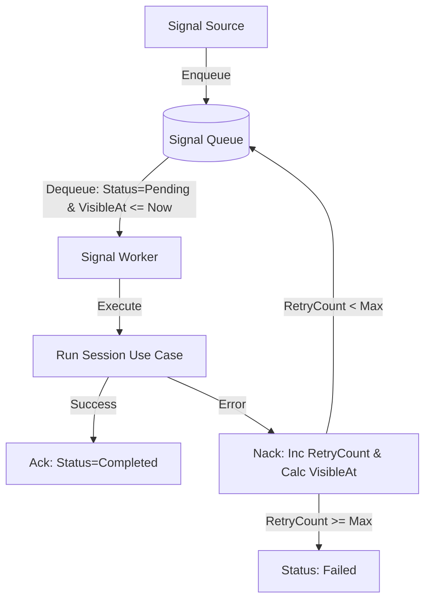

# Requirements

### Overview & Goals
The current queuing implementation in `QueuedHaasEngine` lacks a robust retry strategy, leading to "infinite processing" loops when a signal consistently causes an error. This task aims to implement queuing best practices, specifically a maximum retry limit (Dead Letter Queue logic) and exponential backoff, to ensure system stability and provide better observability into failed operations.

### Scope
- **In Scope**:
    - Implementing a maximum retry limit for queued signals.
    - Introducing exponential backoff for failed signals.
    - Storing the last error message within the queued signal state.
    - Updating both In-Memory and SQLite queue implementations.
    - Enhancing worker logging for failed and retried signals.
- **Out Scope**:
    - Implementing a UI for managing failed signals.
    - Changing the underlying queuing technology (e.g., moving to RabbitMQ or SQS).
    - Automatic recovery/re-processing of failed (DLQ) signals.

### Functional Requirements
- Signals that fail during processing must be retried up to a maximum number of times (default 3).
- Each subsequent retry must be delayed using an exponential backoff strategy (e.g., 2, 4, 8 seconds).
- Signals that exceed the maximum retry count must be marked as `Failed` and excluded from further automatic processing.
- The error message that caused the last failure must be persisted with the signal.
- Multiple workers must be able to safely dequeue signals without processing the same signal simultaneously.


# Technical Design

### Current Implementation
Signals are managed by `QueuedHaasEngine` which uses `SignalWorker` to process items from an `ISignalQueue`. Currently, when `SignalWorker` encounters an exception, it calls `NackAsync`, which immediately re-enqueues the signal as `Pending`, resulting in an immediate retry and a potential infinite loop if the error persists.

### Proposed Changes

#### Data Model & Domain
- **`QueuedSignal`**: Add `VisibleAt (DateTimeOffset?)` and `LastError (string?)`.
- **`SignalStatus`**: Leverage the existing `Failed` status to represent Dead Lettered signals.

#### Queue Logic (`ISignalQueue` Implementations)
- **`NackAsync(string id, string? error)`**:
    1. Increment `RetryCount`.
    2. If `RetryCount >= MaxRetries`:
        - Set `Status = Failed`.
        - Set `VisibleAt = null`.
    3. Else:
        - Set `Status = Pending`.
        - Calculate `VisibleAt = DateTimeOffset.UtcNow.AddSeconds(Math.Pow(2, RetryCount))`.
    4. Store `error` in `LastError`.
- **`DequeueAsync()`**:
    - Update the query to filter for `Status == Pending` AND (`VisibleAt == null` OR `VisibleAt <= UtcNow`).

#### SQLite Atomic Dequeue
To improve reliability in multi-worker scenarios, `SharedSqliteSignalQueueStore.DequeueAsync` will be refactored to use an atomic update pattern:
```sql
UPDATE signal_queue 
SET status = 'processing', picked_at = $now 
WHERE id = (
    SELECT id FROM signal_queue 
    WHERE status = 'pending' AND (visible_at IS NULL OR visible_at <= $now) 
    ORDER BY created_at ASC LIMIT 1
)
RETURNING *;
```

#### Architecture Diagram


### Risks
- **SQLite Version**: `RETURNING` clause requires SQLite 3.35.0+. We will fall back to a transaction-wrapped update if needed, but modern .NET environments typically support this.
- **In-Memory Behavior**: Simple re-enqueuing in `InMemorySignalQueue` might cause some CPU cycles if the worker constantly checks a non-visible head of the queue. We will mitigate this by ensuring `DequeueAsync` efficiently skips non-visible items.


# Testing

### Validation Approach
Verification will focus on the state transitions of the queue and the timing of retries.

### Key Scenarios
- **Successful Retry**: A signal fails once, is re-enqueued with a delay, and succeeds on the second attempt.
- **Max Retries Reached**: A signal fails 3 times and is moved to `Failed` status.
- **Visibility Delay**: A signal that just failed is not immediately available for dequeueing by any worker.
- **Error Persistence**: The `LastError` field correctly stores the exception message from the failing worker.

### Test Changes
- **`SharedSqliteSignalQueueStoreTests`**: Add cases for `Nack` with backoff and max retry exhaustion.
- **`SignalWorkerTests`**: (To be created) Verify that the worker correctly handles exceptions and communicates with the queue.


# Delivery Steps

### ✓ Step 1: Update Domain and Port for Retry Metadata
Enhance the `QueuedSignal` record and `ISignalQueue` port to support backoff and error tracking.

- Add `VisibleAt` and `LastError` properties to `QueuedSignal`.
- Update `ISignalQueue.NackAsync` to accept an optional error message.
- Add `Failed` status handling in the domain logic.

### ✓ Step 2: Implement Backoff and DLQ in SQLite Queue Storage
Update the SQLite-based queue to handle retry limits, exponential backoff, and atomic dequeuing.

- Modify `SharedSqliteSignalQueueStore` schema to include `visible_at` and `last_error` columns.
- Update `NackAsync` to calculate backoff time (2^RetryCount * 1s) and set `Failed` status if `RetryCount >= MaxRetries`.
- Refactor `DequeueAsync` to use an atomic `UPDATE` with `RETURNING` (or equivalent) to safely pick signals in a multi-worker environment, filtering by `VisibleAt`.

### ✓ Step 3: Implement Retry Logic in InMemorySignalQueue
Ensure the in-memory queue used for development and testing also respects the new retry policies.

- Update `InMemorySignalQueue.NackAsync` with the same retry limit and backoff logic.
- Modify `InMemorySignalQueue.DequeueAsync` to skip items that are not yet visible.
- Ensure thread safety for concurrent access to the backoff-aware queue.

### ✓ Step 4: Integrate with SignalWorker and Verify Behavior
Connect the worker to the new queue capabilities and add verification.

- Update `SignalWorker.ProcessNextAsync` to pass exception messages to `NackAsync`.
- Add logging to track signal retry attempts and movements to the failed status.
- Add unit and integration tests to verify that signals are retried with increasing delays and eventually moved to `Failed` status.