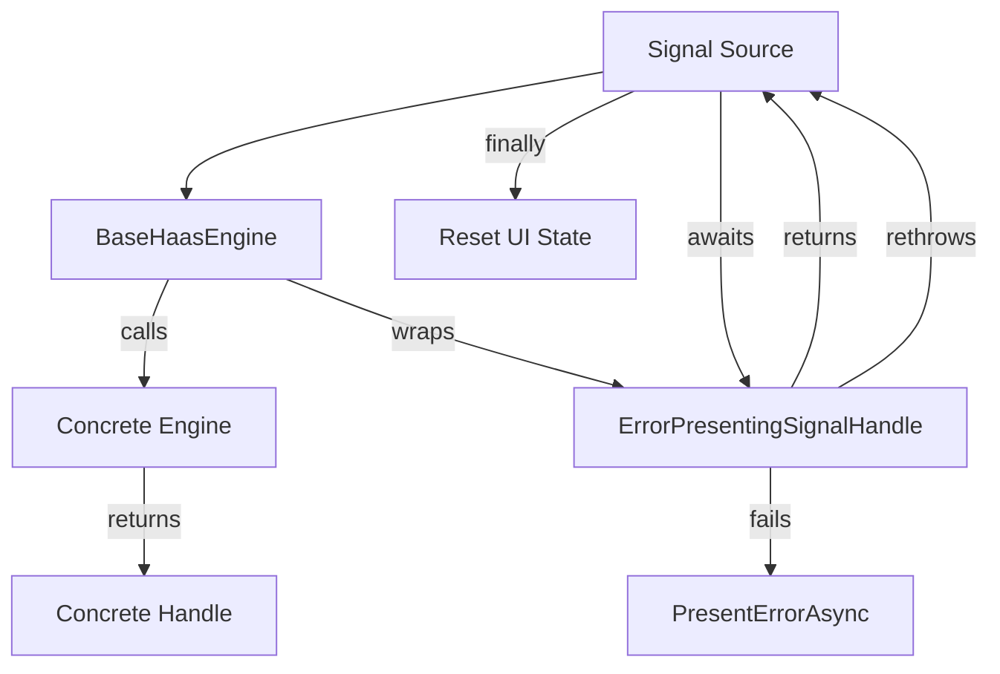

# Requirements

### Overview & Goals
When a HaaS session encounters an exception, the previous implementation relied on Signal Sources (like CLI chat or Tic-Tac-Toe) to catch these exceptions and call the presenter to show the error. This led to duplicated logic across signal sources and placed framework-level responsibilities on the adapters.

The goal is to move the error handling strategy into the **HaaS Framework itself (Engines)** to ensure:
- **Cohesive Error Handling:** All engines (Direct and Queued) consistently present errors.
- **Strategic Presentation:** Errors are presented via `ISignalPresenter.PresentErrorAsync` by the framework, not individual sources.
- **Robustness:** Engines validate that signal handles are correctly returned and never null.
- **Simplified Adapters:** Signal sources focus only on their own state management (e.g., UI cleanup) while the framework handles the "AI errors".

### Scope
- **In Scope:**
    - New `ErrorPresentingSignalHandle` decorator for framework-level error presentation.
    - Centralized error handling in `BaseHaasEngine`.
    - Updates to `DirectHaasEngine` and `QueuedHaasEngine`.
    - Removal of redundant error presentation in `ChatSignalSource`, `TicTacToeSignalSource`, and `CliSignalSource`.
- **Out of Scope:**
    - Changes to `SignalWorker` (already handles error propagation to the store).
    - Automatic retries (remains strategy-level).

# Technical Design

### Current Implementation
- `BaseHaasEngine` calls `ProcessSignalAsync` but doesn't handle exceptions or validate the handle.
- Signal sources wrap `handler` and `WaitForResultAsync` calls in `try-catch` to call `PresentErrorAsync`.
- If an engine failed to return a handle (hypothetically), it would cause an NRE in `BaseHaasEngine`.

### Key Decisions
- **Framework-First Presentation:** The engine is responsible for catching exceptions during both the "start" phase (`ProcessSignalAsync`) and the "completion" phase (`WaitForResultAsync`) and presenting them.
- **Handle Decorator Pattern:** An `ISignalHandle` decorator will be used to inject error presentation logic into the `WaitForResultAsync` call without modifying concrete handle implementations.
- **Exception Propagation:** Exceptions will continue to be propagated to the signal sources so they can handle implementation-specific state (like resetting "AI is thinking" indicators).

### Proposed Changes
- **Infrastructure (`HaaS.Infrastructure`):**
    - `ErrorPresentingSignalHandle`: A new internal class implementing `ISignalHandle` that wraps another handle and its presenter.
    - `BaseHaasEngine`: 
        - Rename `ProcessSignalAsync` to `ExecuteProcessSignalAsync` (protected abstract).
        - Implement `ProcessSignalAsync` as a non-abstract wrapper that handles exceptions, null-checks, and handle decoration.
- **Adapters (`HaaS.Host.CLI`):**
    - `ChatSignalSource`, `TicTacToeSignalSource`, `CliSignalSource`: Remove `PresentErrorAsync` calls; retain `try-catch` or `finally` only for UI state management.

### Architecture Diagram

### Risks
- **Double Presentation:** If a signal source still calls `PresentErrorAsync`, the error might be shown twice. Mitigated by thorough cleanup in all sources.
- **Handle Wrapping Overhead:** Negligible performance impact for much cleaner architecture.

# Testing

### Validation Approach
I will verify the changes by simulating failures in the agent strategy and ensuring the CLI remains interactive and shows an error message.

### Key Scenarios
1. **Direct Execution Failure:** Simulate an error in `ChatModule` (Direct Engine) and verify the chat loop stays alive and shows the error.
2. **Queued Execution Failure:** Simulate an error in `TicTacToeModule` (Queued Engine) and verify the UI doesn't hang indefinitely and shows the error.
3. **Busy State Recovery:** Ensure the "AI is thinking..." indicator is removed even when an error occurs.

# Delivery Steps

### ✓ Step 1: Implement Framework-Level Error Handling in BaseHaasEngine
- Create `ErrorPresentingSignalHandle` decorator in `HaaS.Infrastructure`.
- Update `BaseHaasEngine` to use a template method pattern for `ProcessSignalAsync`.
- Rename existing abstract `ProcessSignalAsync` to `ExecuteProcessSignalAsync` and make it protected.
- Implement error catching and handle wrapping in the base class.

### ✓ Step 2: Update Concrete Engines
- Update `DirectHaasEngine` and `QueuedHaasEngine` to implement `ExecuteProcessSignalAsync`.
- Ensure they don't catch exceptions that should be handled by the base engine.

### ✓ Step 3: Cleanup Signal Sources
- Remove redundant `PresentErrorAsync` calls and error handling logic from `ChatSignalSource`, `TicTacToeSignalSource`, and `CliSignalSource`.
- Retain only necessary UI state management (like resetting busy state).

### ✓ Step 4: Verification and Testing
- Run existing tests to ensure no regressions.
- Add or update tests to verify the new decorator and engine behavior.
- Manually verify in the CLI with simulated errors.