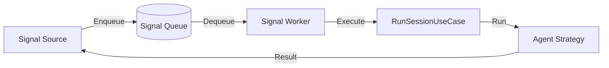

# Next Slice Options

### Overview
Based on the current progress and `SYSTEM-DESIGN.md`, the implementation has a solid foundation for session management and agent execution using the Microsoft Agent Framework. However, it currently operates in a synchronous, inline fashion, which deviates from the "Enterprise AI Harness" design that requires decoupled, governed, and asynchronous processing.

### Vertical Slice Options
The following options are proposed for the next major increment. Each slice represents a cohesive set of changes across all four layers (Domain, Application, Adapter, Infra).

#### Option 1: Signal Queue & Worker Pool (Recommended)
Transition the engine from synchronous execution to a queued model to handle bursts and enable concurrent processing.
- **Why**: Fundamental architectural shift to the "Harness" model described in Section 14.
- **Impact**: Enables background processing, retries, and multi-process scaling.

#### Option 2: Identity & Governance (Auth & Policy)
Introduce the first and second security gates (Authentication and Policy Enforcement).
- **Why**: Critical for enterprise multi-tenancy and tool-level governance.
- **Impact**: Adds `AuthProvider` and `PolicyEngine` to the execution pipeline.

#### Option 3: Specialized Knowledge Stores (Memory & Tasks)
Expand the per-session SQLite database beyond chat history to support long-term memory and task tracking.
- **Why**: Enables more complex agent behaviors (reasoning loops, sub-tasking).
- **Impact**: Adds `MemoryStore` and `TaskStore` ports and adapters.

#### Option 4: Advanced Configuration Resolution
Implement the merger of global default configurations with per-signal overrides.
- **Why**: Allows fine-tuning of models, prompts, and tools on a per-request basis.
- **Impact**: Enhances `ConfigRepository` with complex merge and resolution logic.

### Recommended Direction
The **Signal Queue & Worker Pool** is the recommended next slice. It establishes the core asynchronous pipeline that all other features (Auth, Policy, Knowledge) will eventually plug into. Implementing it now avoids building up architectural debt in the current synchronous execution path.

# Technical Design (Option 1)

### Proposed Implementation: Signal Queue & Worker Pool

#### Current Implementation
- `HaasEngine` listens to signal sources and calls `RunSessionUseCase.ExecuteAsync` directly.
- Processing is synchronous: the engine waits for the agent to finish before listening for the next signal or prompting for input.
- No persistence for signals between ingestion and processing.

#### Proposed Changes
The engine will be split into two main components: **Ingestion** (Signal Sources -> Queue) and **Processing** (Queue -> Worker -> Agent).

**1. Domain Layer**
- New `ISignalQueue` port for atomic signal operations.
- `QueuedSignal` record carrying the original `Signal`, resolved `Identity` (initially anonymous), and `Status`.

**2. Application Layer**
- `EnqueueSignalUseCase`: New use case for the ingestion path.
- `SignalWorker`: Background logic that dequeues signals and executes the existing `RunSessionUseCase`.

**3. Adapter Layer**
- `SharedSqliteSignalQueueStore`: SQLite-backed implementation of the queue.
- Support for `signal_queue.db` in the infra layer.
- `DeferredResponseChannel`: A mechanism for signal sources that need a synchronous response (like CLI/HTTP) to wait for the worker to finish.

**4. Infrastructure Layer**
- Wiring of the `SignalWorker` as a hosted service or background task.
- Configuration for queue depth and worker concurrency.

#### Data Flow

# Delivery Steps

### ✓ Step 1: Implement Signal Queue Domain and Storage
Define the core abstractions for the signal queue in the domain layer and implement the storage adapter.

- Define `ISignalQueue` port in `HaaS.Domain.Ports` with `EnqueueAsync`, `DequeueAsync`, `AckAsync`, and `NackAsync` methods.
- Define `QueuedSignal` domain record carrying signal data, identity, and queue metadata.
- Implement `SharedSqliteSignalQueueStore` in `HaaS.Adapters.Store` following the schema in `SYSTEM-DESIGN.md`.
- Add `signal_queue.db` support to `HaasSqliteExtensions` in `HaaS.Infrastructure`.

### ✓ Step 2: Transition to Queued Ingestion
Modify the ingestion flow to transition from synchronous execution to enqueuing.

- Create `EnqueueSignalUseCase` in `HaaS.Application.UseCases` to handle incoming signals by enqueuing them.
- Update `HaasEngine` to use `EnqueueSignalUseCase` instead of `RunSessionUseCase` directly.
- Update `Signal` value object to support metadata required for queuing (e.g., arrival timestamp).
- Implement a `DeferredSessionResult` mechanism in `HaaS.Adapters` to allow bidirectional sources (like CLI) to wait for a result from the worker.

### ✓ Step 3: Implement Signal Worker Pool
Implement the background worker pool that processes signals from the queue.

- Create `SignalWorker` in `HaaS.Application` that polls the `ISignalQueue` and executes `RunSessionUseCase`.
- Implement a `WorkerPool` or `WorkerService` in `HaaS.Infrastructure` that manages one or more concurrent `SignalWorker` instances.
- Configure concurrency limits (e.g., `MaxConcurrentSessions`) in `appsettings.json` and wire them via DI.
- Update `RunSessionUseCase` to mark tasks as completed/failed in the session repository.

### ✓ Step 4: Demonstrate Queued Flow in CLI Host
Update the CLI host to demonstrate asynchronous, queued processing.

- Update `ChatSignalSource` to support waiting for the asynchronous response from the worker.
- Update `ChatModule` to configure the worker pool and SQLite-backed queue.
- Verify that multiple signals can be enqueued and processed concurrently by the worker pool.
- Add logging to track signal movement through the queue: Enqueued -> Dequeued -> Processing -> Completed.