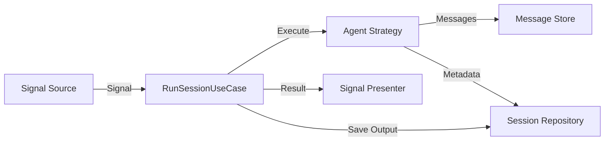

# Requirements

### Overview & Goals
The goal of this task is to review and refine the project's abstractions to ensure they correctly encapsulate domain details and minimize overlap or duplication. Based on the investigation, several areas have been identified where abstractions can be tightened or consolidated to improve the overall architecture and domain alignment.

### Scope
- **Domain Layer**: `Signal`, `SessionRecord`, `IMessageStore`, and new Tooling ports.
- **Application Layer**: Use cases and workers that propagate signal data.
- **Adapter Layer**: Persistence implementations and Agent strategies that bridge Domain to external frameworks.

### Findings & Key Decisions
1. **Transient vs Persistent Results**: Currently, `SessionResult` is transient and stored in a memory-only store for delivery, while `SessionRecord` tracks metadata. We will consolidate the final output into `SessionRecord` to support historical lookups and unify result storage.
2. **Tooling Coupling**: `IToolRegistry` is currently an Adapter-level detail coupled to `Microsoft.Extensions.AI`. We will move its definition to the Domain to allow the domain to express its tooling needs abstractly.
3. **Primitive Obsession in Message Store**: `IMessageStore` uses `string` for messages. We will introduce a `DomainMessage` record to provide better type safety and encapsulation in the Domain layer.

# Technical Design

### Current vs Proposed Abstractions

#### Session Persistence
*Current*: `SessionRecord` (Metadata) + `IMessageStore` (History) + `IDeferredSessionResultStore` (Transient Output).
*Proposed*: `SessionRecord` will include `Output`. `IDeferredSessionResultStore` remains as a transient delivery mechanism (using `TaskCompletionSource`), but the source of truth for the final result will be `SessionRecord`.

#### Message Storage
*Current*: `IMessageStore` works with `IEnumerable<string>`.
*Proposed*: `IMessageStore` will work with `IEnumerable<DomainMessage>`.
```csharp
public record DomainMessage(string Role, string Content, DateTimeOffset Timestamp);
```

#### Tooling
*Current*: `IToolRegistry` in Adapters, using `AITool`.
*Proposed*: `IToolProvider` in Domain Ports, using `ToolDefinition`.
```csharp
public record ToolDefinition(string Name, string Description, Delegate Handler);
```

### Architecture Diagram


# Delivery Steps

### ✓ Step 1: Consolidate Session Results into SessionRecord
Bridge the gap between transient results and persistent session history.

- Update `SessionRecord` to include an `Output` property.
- Update `RunSessionUseCase` to save the `SessionResult.Output` into the `SessionRecord` when completing.
- Evaluate if `IDeferredSessionResultStore` can be simplified or if it remains necessary for real-time `TaskCompletionSource` behavior.

### * Step 2: Evolve Tool Registry into a Domain Port
Improve the domain's awareness of tools without coupling to a specific AI framework.

- Move `IToolRegistry` (or a domain-level equivalent `IToolProvider`) into `HaaS.Domain.Ports`.
- Define a domain-friendly `ToolDefinition` that doesn't depend on `Microsoft.Extensions.AI`.
- Update `MicrosoftAgentFrameworkStrategy` to use the new domain port.

###   Step 3: Refine IMessageStore with Domain-specific message records
Move away from raw strings in the persistence ports for better domain encapsulation.

- Create a `DomainMessage` record in `HaaS.Domain.ValueObjects`.
- Update `IMessageStore` to use `DomainMessage` instead of `string`.
- Update `PersistedChatHistoryProvider` to map between `DomainMessage` and `Microsoft.Extensions.AI.ChatMessage`.