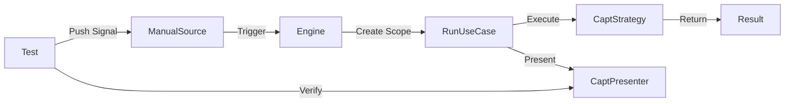

# Requirements

### Overview & Goals
Review and consolidate testing guidance in `AGENTS.md`, ensure existing tests adhere to these standards, and introduce a strategy for integration testing the "HaaS machinery" without requiring LLM invocations.

### Scope
- **AGENTS.md**: Consolidate testing rules from three different sections into one cohesive section. Add new principles for test reliability, mocking approach, test suite design (boundaries/equivalence partitioning), and the strict use of test data builders instead of manual model instantiation.
- **Existing Tests**: Review `src/**/*.Tests` and refactor identified violations (specifically `NSubstitute` usage and missing `SutBuilder` patterns).
- **Integration Testing**: Implement a representative integration test that verifies the full signal-to-presenter pipeline using DI and the core engine.

### User Stories
- As a **Developer**, I want a single source of truth for testing standards so that I can write consistent, high-quality tests.
- As a **Maintainer**, I want to ensure tests are reliable (pass/fail for the right reason) and don't rely on "magic" mocking libraries.
- As an **Architect**, I want to verify the system's "machinery" (wiring, scopes, orchestration) is working correctly without the cost or flakiness of real LLM calls.

# Technical Design

### Current Implementation
Testing guidance is currently split across `Dev approach`, `Testing`, and `Coding conventions`. While core application tests follow the patterns well (Triple-A, SutBuilder), some adapter tests use `NSubstitute` and direct instantiation.

### Key Decisions
- **Unified Testing Section**: Group all testing concerns (Philosophy, Structure, Assertions, Principles) under one header in `AGENTS.md`.
- **Manual Fakes**: Standardize on manual fakes (file-scoped classes/records) instead of mocking frameworks like `NSubstitute` to keep tests explicit and avoid library magic.
- **Machinery Integration**: Use `Microsoft.Extensions.Hosting` (or just `ServiceCollection`) to build the real system container but replace only the `IAgentStrategy` (the LLM bridge) with a capturing fake.

### Proposed Changes

#### AGENTS.md Reorganization
```markdown
## Testing

### Philosophy
- **TDD** — Red-green-refactor.
- **Thin vertical slices** — Every feature cuts through all four layers.
- **Pass/Fail for the right reason** — Avoid tests that pass regardless of whether the logic under test is actually executed. Verify side effects, not just return values.
- **Comprehensive coverage via analysis** — Design test suites by analyzing boundaries and equivalence partitions of the problem space to ensure all behaviors are covered.

### Structure
- **Triple-A (Arrange, Act, Assert)** — Every test body starts with `// Arrange`, `// Act`, `// Assert` comments.
- **SutBuilder per test class** — Use a private `file sealed class SutBuilder` at the bottom of the file.
- **No manual model instantiation** — Tests must never manually `new` up data models, value types, or complex objects. Always use `*TestBuilder` classes or the `SutBuilder`.
- **Builders for Domain Objects** — Use `*TestBuilder` classes for domain entities/records.
- **Manual Fakes over Mocks** — Prefer `file sealed` fake implementations of ports over mocking libraries (NSubstitute/Moq).

### Assertions (NExpect)
- Use fluent `Expect(actual).To.Equal(expected)` syntax.
- **No magic strings** — Assert against Arrange variables, not hardcoded literals.
```

#### Integration Test Strategy
- **File**: `HaaS.Infrastructure.Tests.MachineryIntegrationTests`
- **Component**: `ManualSignalSource` — Allows pushing signals manually during tests.
- **Component**: `CapturingStrategy` — Fakes the LLM call and records input/output.
- **Flow**:


### Risks
- **Refactoring overhead**: Replacing `NSubstitute` in existing tests requires manual effort but aligns with the project's DDD/explicit style.
- **Integration test complexity**: Managing the `IHaasEngine` lifecycle in tests requires careful handling of `StartAsync`/`StopAsync`.

# Testing

### Validation Approach
I will verify the changes by running the full test suite and ensuring the new integration test passes.

### Key Scenarios
- **Refactored Unit Tests**: Verify `ObservabilityDecoratorTests` and `ToolProviderTests` pass after switching to manual fakes and `SutBuilder`.
- **Machinery Integration**: Verify a signal pushed through `ManualSignalSource` results in a call to `CapturingStrategy` and eventually reaches `CapturingPresenter`.
- **AGENTS.md Compliance**: Spot check 3-5 random test files against the new unified section.

# Delivery Steps

### ✓ Step 1: Consolidate and update AGENTS.md testing guidance
Consolidate all testing-related rules into a single 'Testing' section.
- Merge guidelines from 'Dev approach', 'Testing', and 'Coding conventions'.
- Add 'Tests should pass/fail for the right reason' principle with concrete examples.
- Add guidance on designing test suites using boundary analysis and equivalence partitioning.
- Add 'No manual model instantiation' rule — mandate use of builders for all object creation.
- Add 'Manual fakes over mocking frameworks' principle as per user preference.
- Define a clear 'Structure' section for Triple-A (Arrange, Act, Assert) and SutBuilder patterns.

### ✓ Step 2: Analyze existing test suites for boundary and equivalence partition coverage
Verify that existing tests provide comprehensive coverage of the problem space.
- Review key test suites (e.g., `RunSessionUseCaseTests`, `ObservabilityDecoratorTests`) against their domain requirements.
- Identify missing boundary cases (e.g., empty payloads, max-length strings, null dependencies).
- Identify missing equivalence partitions (e.g., different types of signals, error vs success paths).
- Document gaps to be addressed in the following refactoring step.

### ✓ Step 3: Review and refactor existing tests for technical compliance
Refactor tests using NSubstitute, missing SutBuilders, and manual instantiation.
- Fix `ObservabilityDecoratorTests.cs`: add `SutBuilder`, replace `NSubstitute` with local manual fakes.
- Fix `ToolProviderTests.cs`: replace `NSubstitute` with local manual fakes.
- Replace manual model instantiation with `*TestBuilder` usage across the test suite.
- Address coverage gaps identified in the previous analysis step.
- Scan and fix any other violations of the consolidated guidelines.

### ✓ Step 4: Implement HaaS Machinery Integration Test
Create a new integration test demonstrating LLM-less system verification.
- Add `src\HaaS.Infrastructure.Tests\MachineryIntegrationTests.cs`.
- Implement an end-to-end test flow: `ManualSignalSource` -> `IHaasEngine` -> `RunSessionUseCase` -> `CapturingStrategy` (Fake) -> `CapturingPresenter` (Fake).
- Verify that signals are correctly routed, scoped, and processed without invoking real LLM clients.