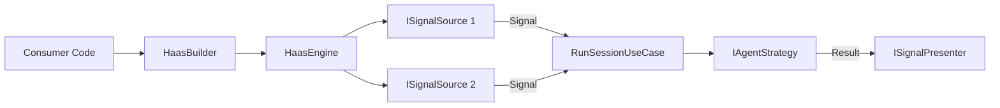

# Requirements

### Overview & Goals
The goal is to simplify how consumers interact with the Haas engine. Currently, consumers must manually manage signal sources, listen for signals, and execute use cases. This project introduces a `HaasEngine` that abstracts these internal details, allowing consumers to simply register their `ISignalSource` and start the engine.

### Scope
- **In Scope**:
    - Introduction of `IHaasEngine` for automated session orchestration.
    - Implementation of `HaasEngine` with support for parallel signal sources and session affinity.
    - New registration extensions in `HaasBuilder` for a fluent IoC setup.
    - Refactoring of `ChatModule` and `TicTacToeModule` to demonstrate the simplified usage.
- **Out of Scope**:
    - Modifying the core agent strategy or message store logic.
    - Introducing a full background service host (though the engine will be compatible with `IHostedService`).

# Technical Design

### Current Implementation
Consumers currently perform the following steps:
1. Initialize `ServiceCollection` and call `AddHaas()`.
2. Manually register `SignalSourceConfig`.
3. Instantiate `ISignalSource` and `ISignalPresenter`.
4. Call `source.ListenAsync` and manually invoke `RunSessionUseCase.ExecuteAsync` inside the handler.

### Key Decisions
- **Session Affinity**: The `HaasEngine` will track the `LastSessionId` for each registered source. If a signal arrives without a `SessionId`, the engine will automatically use the last known session for that source, ensuring conversation continuity without manual consumer logic.
- **Parallel Source Execution**: The engine will use `Task.WhenAll` to run all registered `ISignalSource.ListenAsync` loops in parallel.
- **Config-Driven Registration**: The `AddSignalSource` extension will allow providing a configuration action, which the engine will use to automatically populate the `ISignalSourceConfigRepository`.

### Proposed Changes
#### `IHaasEngine` (HaaS.Domain)
A simple interface to start the engine:
```csharp
public interface IHaasEngine
{
    Task RunAsync(CancellationToken ct = default);
}
```

#### `HaasEngine` (HaaS.Application)
Orchestrates the lifecycle:
- Collects `SignalSourceRegistration` objects from DI.
- Registers configurations at startup.
- Manages the `ListenAsync` loops and session ID propagation.

#### `HaasBuilder` Extensions (HaaS.Infrastructure)
New fluent API:
```csharp
services.AddHaas()
    .AddSignalSource<MySource, MyPresenter>(config => {
        config.Provider = "ollama";
        config.ModelId = "gemma2";
    });
```

### Architecture Diagram


# Testing

### Validation Approach
I will verify the changes by ensuring the existing CLI modules function identically but with significantly reduced boilerplate code.

### Key Scenarios
- **Chat Continuity**: Verify that consecutive messages in the AI Chat module belong to the same session without manual session ID management in the module.
- **Tic-Tac-Toe State**: Verify that the AI opponent in Tic-Tac-Toe still makes valid moves and the game state is correctly preserved and presented.
- **Engine Startup**: Verify that `SignalSourceConfig` is correctly registered in the repository during engine initialization.

# Delivery Steps

### ✓ Step 1: Define Engine Abstractions and Update Use Cases
### Introduce `IHaasEngine` and `SignalSourceRegistration`
Define the core interfaces and data models for the Haas engine.

- Add `IHaasEngine` interface to `HaaS.Domain.Ports`.
- Add `SignalSourceRegistration` to `HaaS.Application` to hold signal source, presenter, and session state.
- Update `RunSessionUseCase.ExecuteAsync` to return the `sessionId` for tracking.

### ✓ Step 2: Implement HaasEngine Orchestrator
### Implement `HaasEngine`
Create the engine that orchestrates signal source execution and session management.

- Implement `HaasEngine` in `HaaS.Application`.
- Implement `RunAsync` to initialize configurations and run all registered signal sources in parallel.
- Handle session continuity within the engine by tracking the last session ID per source.

### ✓ Step 3: Expose Engine Registration in HaasBuilder
### Enhance IoC Registration
Update `HaasBuilder` to support streamlined signal source registration.

- Add `AddSignalSource<TSource, TPresenter>` extensions to `HaasBuilder` in `HaaS.Infrastructure`.
- Implement `SignalSourceConfigBuilder` to allow fluent configuration during registration.
- Register `IHaasEngine` in the `AddHaas` extension method.

### ✓ Step 4: Refactor CLI Examples to use HaasEngine
### Refactor CLI Modules
Update existing CLI modules to use the new engine.

- Refactor `ChatModule` to use `IHaasEngine` and the new registration methods.
- Refactor `TicTacToeModule` to move game-specific logic into `TicTacToeSignalSource` and use the engine for execution.
- Update `TicTacToeSignalSource` to handle "AI thinking" indicators and game state validation.