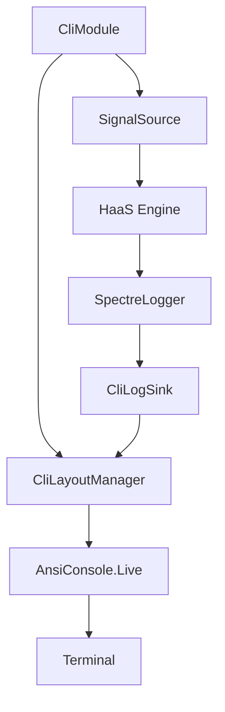

# Requirements

### Overview & Goals
Enhance the HaaS CLI experience by integrating `Spectre.Console` for a modern, professional look and feel. A key requirement is the visual separation of logging output from the main content (chat/game) to improve observability without cluttering the user interface.

### Scope
- **In Scope:**
    - Refactoring `CliMenu` to use `SelectionPrompt`.
    - Implementing a split-screen layout (Content on top, Logs at the bottom).
    - Upgrading `AI Chat` module visuals and input handling.
    - Upgrading `Tic-Tac-Toe` module with a table-based board and interactive prompts.
    - Creating a new logging adapter for `Spectre.Console`.
- **Out of Scope:**
    - Adding new game features to Tic-Tac-Toe.
    - Implementing the "Settings" menu (remains "coming soon").
    - Modifying core domain logic or AI strategy.

### Functional Requirements
- The CLI must show a vertical split screen where the bottom ~30% is dedicated to a scrolling log pane.
- The main content area must display chat history or the game board.
- Logs must update in real-time even while the AI is "thinking".
- User prompts should be styled and integrated into the layout where possible.
- The Tic-Tac-Toe board must be rendered as a clear grid using Spectre's `Table` component.


# Technical Design

### Current Implementation
- **Logging**: `ConsoleLogger` writes directly to `Console.Error`. Logs are intermingled with output or appear unpredictably.
- **Input**: Raw `Console.ReadLine` calls in `ChatSignalSource` and `TicTacToeSignalSource`.
- **UI**: Basic `Console.WriteLine` calls with manual formatting (e.g., `new string('=', 40)`).

### Key Decisions
- **Vertical Split Layout**: A `Spectre.Console.Layout` will be used to divide the terminal into `Main` (top) and `Logs` (bottom) sections.
- **Log Buffering**: A `CliLogSink` will maintain a fixed-size queue of recent logs to allow the `Logs` pane to "scroll" or refresh during live updates.
- **Live Refresh**: Use `AnsiConsole.Live` during asynchronous operations (like waiting for AI response) to keep the log pane active while showing progress.

### Proposed Changes

#### Layout Manager
A new `CliLayoutManager` will manage the global terminal state:
```csharp
public class CliLayoutManager {
    public Layout Layout { get; }
    public void SetMainContent(IRenderable content);
    public void AddLog(string log);
    public Task RunLiveAsync(Func<Task> action);
}
```

#### Observability
A new `SpectreLogger` will be implemented:
- It implements `ILogger`.
- Instead of writing to `Console.Error`, it appends formatted markup to the `CliLogSink`.

#### Component Updates
- **`ChatSignalSource`**: Will use `TextPrompt` for user messages.
- **`TicTacToeSignalSource`**: Will use `Table` for the board and `SelectionPrompt` for moves.
- **`CliSignalPresenter`**: Will push formatted `Panel` content to the `Main` area of the layout.

### File Structure
- `src/HaaS.Host.CLI/Infrastructure/`
    - `CliLogSink.cs`
    - `CliLayoutManager.cs`
    - `SpectreLogger.cs`
- `src/HaaS.Host.CLI/`
    - `CliMenu.cs` (Updated)
    - `ChatModule.cs` (Updated)
    - `ChatSignalSource.cs` (Updated)
    - `CliSignalPresenter.cs` (Updated)
- `src/HaaS.Host.CLI/TicTacToe/`
    - `TicTacToeSignalSource.cs` (Updated)

### Architecture Diagram



# Testing

### Validation Approach
Verification will be performed by running the CLI host and manually interacting with the modules.

### Key Scenarios
- **Main Menu**: Verify that the menu is navigable via arrow keys and looks styled.
- **AI Chat**: 
    - Verify that logs (INFO/DEBUG) appear in the bottom pane while the chat is active.
    - Verify that the chat output is rendered clearly in the top pane.
    - Verify that the layout remains stable during input and output.
- **Tic-Tac-Toe**:
    - Verify the board is rendered as a `Table`.
    - Verify that move selection uses a prompt.
    - Verify that "AI is thinking" uses a spinner.
    - Verify logs appear at the bottom during the game.

### Edge Cases
- **Small Terminal Window**: Check if the layout degrades gracefully or requires a minimum size.
- **Long Log Messages**: Ensure log lines wrap or are truncated to prevent layout breakage.
- **Rapid Input**: Ensure the UI doesn't flicker or lose state during fast interaction.


# Delivery Steps

### ✓ Step 1: Implement CLI Layout and Logging Infrastructure
Infrastructure for separated logging and Spectre-based rendering is implemented.

- Create `CliLogSink` to buffer the most recent log entries.
- Implement `SpectreLogger` (implementing `ILogger`) that writes to the sink.
- Create `CliLayoutManager` to manage the `Spectre.Console.Layout` with `Main` and `Logs` areas.
- Update `HaasCliServiceExtensions` to provide a way to register these components.

### ✓ Step 2: Upgrade CLI Main Menu to Spectre.Console
The main CLI menu is upgraded to use Spectre.Console visuals.

- Refactor `CliMenu.cs` to use `SelectionPrompt` for module selection.
- Apply styling (colors, rules) to the menu header and options.
- Ensure the menu cleans up the screen properly between transitions.

### ✓ Step 3: Refactor AI Chat Module with Split-Screen Layout
The AI Chat module is refactored to use the new layout and Spectre.Console visuals.

- Update `ChatModule.cs` to initialize the `CliLayoutManager` and register `SpectreLogger`.
- Refactor `ChatSignalSource.cs` to use `TextPrompt` for input and handle layout updates during AI "thinking".
- Update `CliSignalPresenter.cs` to render agent responses into the `Main` area of the layout using `Panel` or `Markup`.
- Implement live scrolling for the log pane in the bottom area.

### ✓ Step 4: Upgrade Tic-Tac-Toe Module Visuals and Interaction
The Tic-Tac-Toe module is refactored to use a graphical game board and better prompts.

- Refactor `TicTacToeSignalSource.cs` to render the game board using a Spectre `Table` inside a `Panel`.
- Use `SelectionPrompt` for player moves (1-9) instead of raw text input.
- Replace the dot-based thinking progress with a Spectre `Status` (spinner).
- Integrate the split-screen layout to show game logs at the bottom while playing.